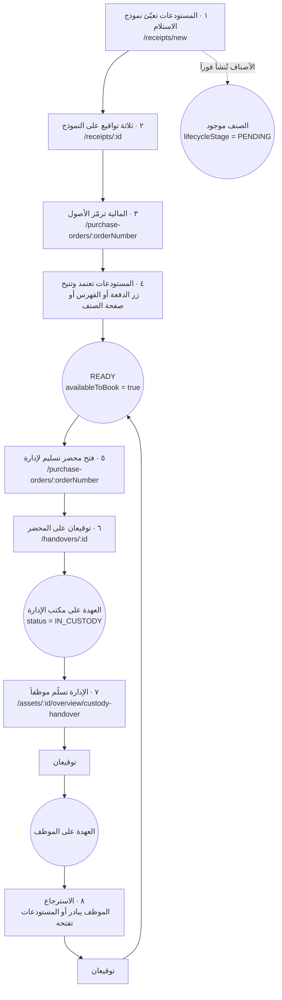

# دورة حياة الصنف كاملةً (Asset lifecycle, end to end)

من لحظة وصول التوريدة إلى المستودع حتى توقيع الموظف على استلامها — ومعها **كل
جدول يُكتب فيه** عند كل خطوة.

هذا المستند مرجعٌ للتتبّع: حين يسأل أحدهم «أين ذهب هذا الصنف؟» أو «لماذا لا
يظهر؟»، الجواب في أي مرحلة هو، وأي صفٍّ في القاعدة يشهد عليها.

> **اصطلاح:** `INSERT` إنشاء صفّ، `UPDATE` تعديل، `UPSERT` إنشاء‑أو‑تعديل.
> ما ليس جدولاً (حاويات التخزين، متتاليات Postgres) مذكورٌ صراحةً بذلك.

---

## نظرة عامة

**الملاحظة التي تُصحّح أشيع سوء فهم:** الأصناف **تُنشأ لحظة حفظ النموذج**، قبل
أي توقيع. التواقيع الثلاثة تحرس **الاعتماد** لا الإنشاء. الصنف موجودٌ في السجل
من الخطوة الأولى، لكنه `PENDING` — لا يراه الموظفون، ولا يُسلَّم عهدةً، ولا يدخل
دفعة تسليم.

---

## المرحلة ١ — إدخال التوريدة

الباب **الوحيد** لدخول الأصناف. `/assets/new` و`/assets/import` والتكرار
و`POST /api/v1/assets` كلها مغلقة.

|            |                                                                                        |
| ---------- | -------------------------------------------------------------------------------------- |
| **من**     | المستودعات — `goodsReceipt.create`                                                     |
| **المسار** | `/receipts/new` → [`receipts.new.tsx`](../webapp/app/routes/_layout+/receipts.new.tsx) |
| **الخدمة** | `createGoodsReceipt` ← `materializeReceiptItems`                                       |

| الجدول             | العملية  | ماذا يُكتب                                                                                              |
| ------------------ | -------- | ------------------------------------------------------------------------------------------------------- |
| `GoodsReceipt`     | `INSERT` | `state = SAVED` · `reference = EPDA-RCV-YYYY-NNNN` · `pageCount` (يشتقّه النظام) · الترويسة والإجماليات |
| `GoodsReceiptLine` | `INSERT` | سطر لكل بند: الاسم، الكمية، `unitPriceHalalas`، `itemCategory`، `itemClass` (يُشتقّ من حد الرسملة)      |
| `Asset`            | `INSERT` | **صفّ لكل صنف** — `lifecycleStage = PENDING` · `status = AVAILABLE` · `valuation` · `sequentialId`      |
| `Qr`               | `INSERT` | رمز QR لكل صنف                                                                                          |
| `Asset`            | `UPDATE` | `receiptLineId` + `itemClass` — ربط الصنف بسطره                                                         |

**ليس جدولاً:** متتالية Postgres `org_<orgId>_asset_sequence` — منها يأتي
`SAM-0001`، عبر الدالة `get_next_sequential_id`.

> **لماذا سطرٌ واحد قد يصير خمسين صفّاً — أو صفّاً واحداً بكمية خمسين:** عمود
> «طريقة التتبّع» في النموذج. `INDIVIDUAL` تُنتج صفّاً لكل وحدة، و`BULK` تُنتج
> صفّاً واحداً بكمية.

---

## المرحلة ٢ — التواقيع الثلاثة

|            |                                                    |
| ---------- | -------------------------------------------------- |
| **من**     | ثلاثة أطراف يحدّدها نوع النموذج (`partiesForType`) |
| **المسار** | `/receipts/:receiptId`                             |
| **الخدمة** | `storeReceiptSignature` ← `signGoodsReceipt`       |

| الجدول                  | العملية  | ماذا يُكتب                                                |
| ----------------------- | -------- | --------------------------------------------------------- |
| `GoodsReceiptSignature` | `UPSERT` | صفّ لكل طرف: الاسم المصرَّح، مسار الصورة، IP، وقت التوقيع |
| `GoodsReceipt`          | `UPDATE` | **عند التوقيع الأخير فقط**: `state = SIGNED` · `signedAt` |

**ليست جدولاً:** حاوية التخزين `goods-receipt-signatures` في Supabase — صورة
التوقيع PNG.

⚠️ **قبل الترقية إلى `SIGNED` تُستدعى `materializeReceiptItems` مرة ثانية.**
شبكة أمان لا تكرار: إنشاء الأصناف يقع **خارج** ترانزاكشن النموذج، ففشلٌ في
المنتصف يترك نموذجاً محفوظاً بأصناف أقل من أسطره. الاستدعاء idempotent (يتخطّى
كل سطر أنتج أصنافاً)، وإن فشل بقي النموذج `SAVED` ولم يُرقَّ — أفضل من مستندٍ
نهائي يُبلّغ عن أقل مما وصل.

---

## المرحلة ٣ — الترميز المالي

|            |                                                                                             |
| ---------- | ------------------------------------------------------------------------------------------- |
| **من**     | المالية — `asset.update` (**لا** `goodsReceipt.update`: الرقم يقع على الصنف لا على المستند) |
| **المسار** | `/purchase-orders/:orderNumber` — حقل داخل صفّ كل صنف                                       |
| **الخدمة** | `setAssetFinanceCode`                                                                       |

| الجدول  | العملية  | ماذا يُكتب                                            |
| ------- | -------- | ----------------------------------------------------- |
| `Asset` | `UPDATE` | `financeCode` · `financeCodedAt` · `financeCodedById` |

**القواعد:**

- **الأصول فقط.** المواد تُرفض بـ`400` — تُصرَف على الاستهلاك ولا تُرمَّز.
- **الصنف بلا تصنيف يُرفض** — التصنيف هو ما يقول إن الترميز مستحقّ.
- **لا صيغة ولا تفرّد** — نظام الترميز ملك المالية، وفرضُ قاعدة هنا اختراعٌ
  لضابط لم يُطلب.
- **المسح يكتب `""` لا `null`** — كل فحصٍ للاكتمال يجب أن يسأل عن الاثنين.

---

## المرحلة ٤ — الاعتماد والإتاحة

**البوابة الحاسمة.** هنا يخرج الصنف من الانتظار إلى التداول.

|            |                                               |
| ---------- | --------------------------------------------- |
| **من**     | المستودعات — `asset.approve`                  |
| **الخدمة** | `approveAssetsByIds` — جسمٌ واحد لثلاثة أبواب |

| الباب                  | المسار                                                 |
| ---------------------- | ------------------------------------------------------ |
| دفعة أمر الشراء        | `/purchase-orders/:orderNumber` ← `approveOrderAssets` |
| اعتماد جماعي من الفهرس | `/assets` ← `bulkApproveAssets`                        |
| صنف مفرد               | `/assets/:id/overview` ← `updateAssetLifecycleStage`   |

| الجدول  | العملية  | ماذا يُكتب                                                      |
| ------- | -------- | --------------------------------------------------------------- |
| `Asset` | `UPDATE` | `lifecycleStage = READY` · `availableToBook = true`             |
| `Note`  | `INSERT` | ملاحظة لكل صنف تشرح الأثر — الحقل ينقلب بلا أن يلمس أحدٌ مفتاحه |

### بوابتان تحرسان هذه الخطوة

| البوابة                               | تمنع                                   | مطبَّقة على         |
| ------------------------------------- | -------------------------------------- | ------------------- |
| `assertReceiptSignedBeforeApproval`   | اعتماد صنفٍ نموذجُه `DRAFT` أو `SAVED` | **الأبواب الثلاثة** |
| قفل الترميز (`getOrderApprovalState`) | اعتماد أمرٍ فيه أصلٌ بلا رقم ترميز     | باب أمر الشراء      |

**استثناءات مقصودة من بوابة التواقيع:** الصنف **بلا `receiptLine`** يمرّ (مخزون
سابق للمسار)، والنموذج **الملغى** معفى (المخزون وصل فعلاً؛ تجميده للأبد أسوأ).

**استثناءات مقصودة من قفل الترميز:** المواد لا تُحتسب، وأصناف النموذج الملغى
مستبعَدة، و`itemClass: null` لا يمنع.

---

## المرحلة ٥ — فتح محضر تسليم لإدارة

|            |                                                      |
| ---------- | ---------------------------------------------------- |
| **من**     | المستودعات — `asset.custody`                         |
| **المسار** | `/purchase-orders/:orderNumber` — «فتح محضر التسليم» |
| **الخدمة** | `openHandover`                                       |

| الجدول                 | العملية       | ماذا يُكتب                                                                                                             |
| ---------------------- | ------------- | ---------------------------------------------------------------------------------------------------------------------- |
| `CustodyHandover`      | `UPDATE MANY` | إبطال كل محضر مفتوح على الأصناف نفسها → `VOIDED`                                                                       |
| `CustodyHandover`      | `INSERT`      | `reference = EPDA-HO-YYYY-NNNN` · `state = AWAITING_SIGNATURES` · `counterpartyTeamMemberId` · `releasingTeamMemberId` |
| `CustodyHandoverAsset` | `INSERT`      | **سطر لكل صنف** مع كميته                                                                                               |

⚠️ **لا شيء تحرّك بعد.** المحضر مستندٌ مفتوح فقط؛ العهدة تنتقل بالتوقيع الثاني.

**الكل أو لا شيء:** صنفٌ واحد غير صالح يرفض الدفعة كاملةً. محضرٌ يسرد أصنافاً
أقل مما تحرّك فعلاً لا يكتشفه أحد إلا في الجرد.

---

## المرحلة ٦ — توقيعا المحضر، والأثر

|            |                                                          |
| ---------- | -------------------------------------------------------- |
| **من**     | طرفان — ولا يوقّع شخص واحد نصفَي محضر ولو ملك الصلاحيتين |
| **المسار** | `/handovers/:handoverId`                                 |
| **الخدمة** | `recordHandoverSignature` ← `applyHandoverEffect`        |

| الجدول                     | العملية                        | متى                                                                       |
| -------------------------- | ------------------------------ | ------------------------------------------------------------------------- |
| `CustodyHandoverSignature` | `INSERT`                       | كل توقيع                                                                  |
| `CustodyHandover`          | `UPDATE`                       | **عند الثاني**: `state = COMPLETED` · `completedAt`                       |
| `Custody`                  | `INSERT` / `UPDATE` / `DELETE` | الأثر — انظر أدناه                                                        |
| `Asset`                    | `UPDATE`                       | `status = IN_CUSTODY` (أو `AVAILABLE` في الاسترجاع حين لا يحمل أحد شيئاً) |
| `ActivityEvent`            | `INSERT`                       | `CUSTODY_ASSIGNED` أو `CUSTODY_RELEASED` — حدث لكل صنف                    |
| `Note`                     | `INSERT`                       | ملاحظة لكل صنف تذكر رقم المحضر                                            |

**ليست جدولاً:** حاوية `custody-signatures`.

### قواعد الأثر على `Custody`

- **الإنقاص لا الحذف.** إدارة تسلّم ١٠ من ٣٠ **تحتفظ بـ٢٠**؛ الصفّ يُحذف عند
  الوصول إلى صفر فقط.
- **`increment` لا استبدال** عند الاستلام: موظف يحمل ٥ ويوقّع على ١٠ صار يحمل ١٥.
- **`AVAILABLE` فقط حين لا يحمل أحد شيئاً.**

⚠️ **`assertHandoverStillApplicable` تُعيد فحص المخزون قبل الأثر مباشرةً** —
داخل الترانزاكشن نفسها. التوقيع قد يتأخّر أياماً، وفي الفجوة قد يكون المخزون
تحرّك من مسارٍ آخر (`releaseCustody` أو نافذة الكمية). الرمي يُرجِع الترانزاكشن
كلها، والتوقيع معها.

---

## المرحلة ٧ — الإدارة تسلّم موظفها

المسار **نفسه** حرفياً، بفارق واحد.

|            |                                                         |
| ---------- | ------------------------------------------------------- |
| **من**     | ممثّل الإدارة — `DEPARTMENT` + `departmentTeamMemberId` |
| **المسار** | `/assets/:id/overview/custody-handover`                 |
| **الفارق** | `releasingTeamMemberId` = مكتب الإدارة بدل `null`       |

`null` تعني «من رفّ المستودع». وحين تُملأ، يُنقِص الأثرُ عهدةَ المكتب بدل أن
يسحب من الرفّ — وهو ما يجعل الحساب متّزناً.

⚠️ **التسمية تتبع ما سيحدث فعلاً:** موظف الإدارة يرى «تسليم لموظف» لا «فك عهدة»،
والنافذة تقول «توقيع الإدارة المسلِّمة» لا «توقيع المستودعات» — المكتب لم يلمس
رفّ مستودع قط.

---

## المرحلة ٨ — الاسترجاع

| من يبدأ     | الخدمة                           | ملاحظة                                                                     |
| ----------- | -------------------------------- | -------------------------------------------------------------------------- |
| الموظف نفسه | `openReturnRequest`              | يفحص أنها **في عهدته فعلاً**، ويُعيد المحضر المفتوح إن وُجد بدل إنشاء ثانٍ |
| المستودعات  | `openHandover` بـ`kind = RETURN` | —                                                                          |

الجداول هي جداول المرحلتين ٥ و٦ نفسها، والأثر معكوس: `Custody` تُنقَص أو تُحذف،
و`Asset.status` يعود `AVAILABLE` حين لا يحمل أحد شيئاً.

---

## مسارات فرعية

| الحدث               | الخدمة                      | الجدول                                                               |
| ------------------- | --------------------------- | -------------------------------------------------------------------- |
| إلغاء نموذج استلام  | `voidGoodsReceipt`          | `GoodsReceipt.state = VOIDED` — **والأصناف تبقى**: المخزون وصل فعلاً |
| إرجاع صنف للمراجعة  | `updateAssetLifecycleStage` | `Asset.lifecycleStage = PENDING` — **السبب إلزامي**                  |
| إبطال محضر تسليم    | `voidHandover`              | `CustodyHandover.state = VOIDED`                                     |
| استكمال أصناف ناقصة | `materializeReceiptItems`   | `Asset` — المخرج الوحيد لنموذج وُقِّع قبل اكتشاف النقص               |

---

## خريطة الحالات

| الحقل                   | القيم                                          | من ينقلها                              |
| ----------------------- | ---------------------------------------------- | -------------------------------------- |
| `GoodsReceipt.state`    | `DRAFT` → `SAVED` → `SIGNED` · `VOIDED`        | الحفظ، ثم التوقيع الثالث               |
| `Asset.lifecycleStage`  | `PENDING` ⇄ `READY`                            | الاعتماد / الإرجاع للمراجعة            |
| `Asset.availableToBook` | `false` → `true`                               | الاعتماد (أثرٌ لمرة واحدة، **لا قفل**) |
| `Asset.status`          | `AVAILABLE` ⇄ `IN_CUSTODY`                     | أثر المحضر                             |
| `CustodyHandover.state` | `AWAITING_SIGNATURES` → `COMPLETED` · `VOIDED` | التوقيع الثاني / الإبطال               |

---

## ما يراه كل دور

| الدور      | يرى                   | يفعل                        |
| ---------- | --------------------- | --------------------------- |
| المستودعات | كل شيء                | يُدخل · يعتمد · يسلّم       |
| المالية    | كل شيء                | يرمّز الأصول فقط            |
| المخزون    | كل شيء                | يراقب ويعلّق — **لا يقرّر** |
| الإدارة    | عهدة مكتبها + سجلاتها | تستلم دفعةً وتسلّم موظفيها  |
| الموظف     | `READY` فقط + عهدته   | يستلم ويوقّع                |

⚠️ **الصنف `PENDING` غير مرئي للموظفين** — الاستعلام يُرشَّح بـ`onlyReadyAssets`
للأدوار المقيّدة بسجلاتها. ليس إخفاءَ زر بل شرطاً في الاستعلام.

---

## مراجع

- [مسار الاستلام](./epda-goods-receipt-workflow.md)
- [محاضر التسليم الموقّعة](./epda-custody-signatures.md)
- [مسار اعتماد الأصناف](./epda-asset-intake-workflow.md)
- `CLAUDE.md` — قسم «مسارات العمل المبنية»
